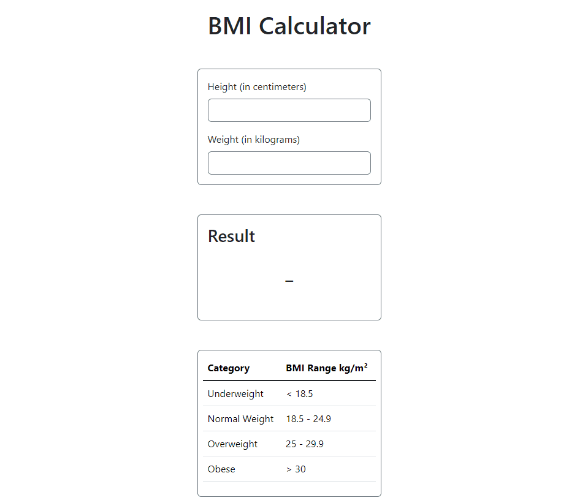

# BMI Calculator

This project is a simple **BMI (Body Mass Index) Calculator** built with HTML, CSS, and JavaScript, styled using Bootstrap 5. It calculates BMI based on user inputs for height and weight and dynamically highlights the BMI category in a reference table.

## Features

* **Interactive Input Fields** : Users can input their height (in cm) and weight (in kg) to calculate their BMI.
* **Real-time Results** : BMI is calculated and displayed instantly as the user inputs their data.
* **Dynamic Table Highlighting** : Highlights the corresponding BMI category in the reference table.

## Demo

## How to Use

1. Open the `index.html` file in your browser.
2. Enter your height in centimeters and weight in kilograms.
3. View your BMI in the results box.
4. Check which BMI category you fall into via the highlighted table row.
